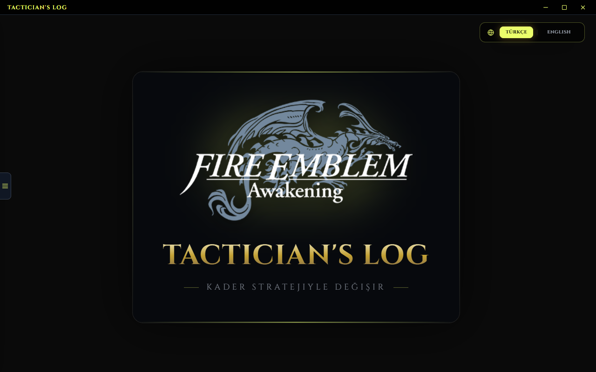
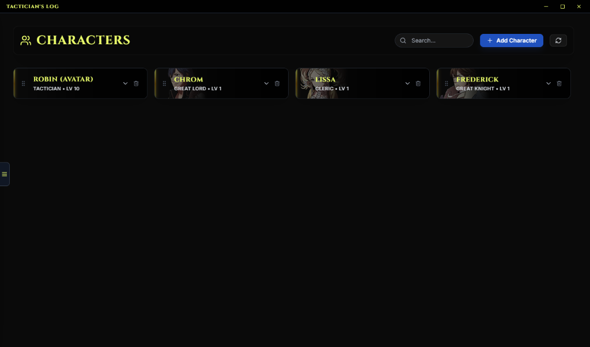
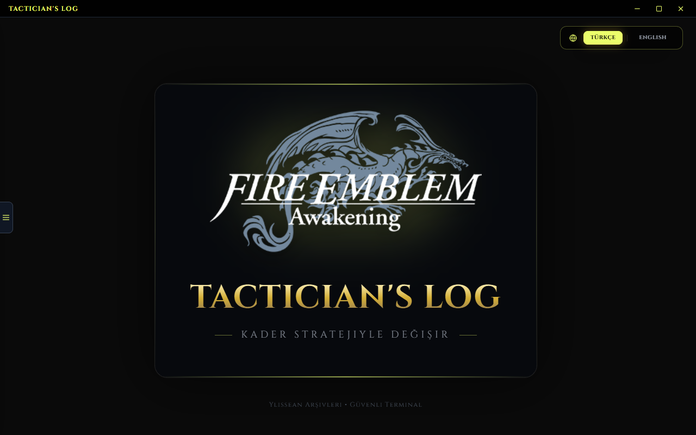
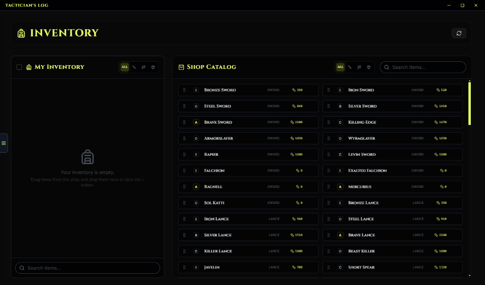
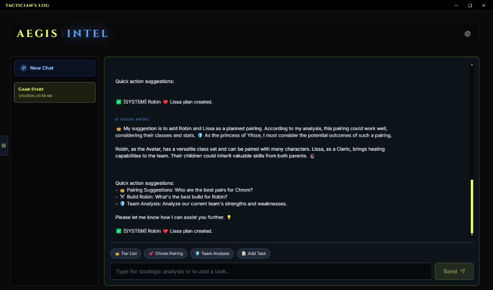

# Tactician's Log 👑

[English] | [Türkçe](./README-TR.md)
  

**The Ultimate Strategy Companion for Fire Emblem Awakening.**

Tactician's Log is a premium desktop application built with React and Electron, designed to elevate your *Fire Emblem Awakening* experience. Featuring the immersive "Ylissean Glass" aesthetic, it combines deep game data with cutting-edge AI integration to serve as your personal strategic advisor.
  

  
  
  
  
  

## 🌟 Key Features

### 🧠 AEGIS (LucinAI) Integration
AEGIS is not just a chatbot; it's your active strategic advisor.
- **Deep Integration:** AEGIS can directly modify characters, manage your inventory, and set up Gene Lab pairings via natural language.
- **Multilingual Advice:** Now supports dynamic language switching (English/Turkish), responding in the language you select for the app.

### 🧬 Genetic Lab (Pairings)
Plan the future of Ylisse with our advanced inheritance simulator.
- **Child Unit Prediction:** See exactly how parent pairings affect a child's stats and classes.
- **Skill & Stat Inheritance:** Track inherited skills and simulate stat growths from Level 1 to 20.

### 🛡️ The Shepherd's Wiki
A complete, built-in library powered by official game data.
- **Comprehensive Data:** View base stats, valid class paths, weapon ranks, and skills for all 50+ playable characters.
- **Ylissean Glass UI:** Immersive, high-performance interface with dynamic animations.

### ⚔️ Inventory & Task Management
- **Persistence:** All your characters, inventory items, and tasks are saved locally.
- **Advanced Tools:** Bulk actions, drag-and-drop sorting, and intelligent filtering.

## 🌍 Multilingual Support
Built for global tacticians. Effortlessly toggle between:
- 🇺🇸 **English**
- 🇹🇷 **Turkish**

## Distribution Options
Check the [Releases](https://github.com/aybrkaknc/Tactician-s-Log/releases) page for the latest version:
- **Installer (Setup.exe):** Standard Windows installation.
- **Portable (Zip):** Truly standalone! Saves all your data in a local `tactician_data` folder inside the app directory—perfect for USB drives.

## 🛠️ Tech Stack
- **Frontend:** React + Vite
- **Desktop:** Electron
- **AI:** Integrated with Gemini, OpenAI, Groq, and more.
- **Localization:** i18next
- **Animations:** Framer Motion
- **Styling:** Custom Vanilla CSS (Ylissean Glass System)

## The Story Behind the Project
It all started during the quiet winter shifts of my job as a night manager at a hotel. I had planned to tackle my gaming backlog, but I realized I’d left my rig (with its beloved 3070 Ti) behind. Armed only with a phone and tablet, I decided to dive into the Nintendo world I missed out on as a kid via emulation. I discovered *Fire Emblem* through a YouTuber playing *Engage*, and as a turn-based strategy fanatic, I was instantly hooked on *Awakening*.

The spark for this specific project, however, came from my girlfriend. We shared a ChatGPT account—she used it for studying, while I turned it into a specialized gaming assistant using its memory features. Naturally, my tons of "useless" gaming data started messing with her study sessions, and I was politely "evicted" from the account.

What began as a simple text file to track skills for creating "meta child units" quickly became unsustainable as my roster grew. So, during my shifts, I built this application using Antigravity. While I’ve dabbled with Firefox extensions before, this is officially my first "vibecode" application.

*I dedicate this project to Özge, who showed me what can be gained when life (or a girlfriend) forces you to fend for yourself. I love you.*

  
## 📄 License
This is a non-commercial fan project. *Fire Emblem* is a trademark of Nintendo and Intelligent Systems.

